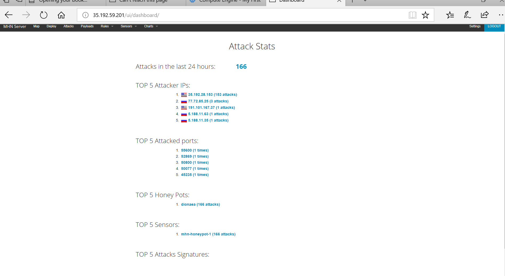

# Codepath-Week-9

I deployed the Ubuntu - Dionaea with HTTP honeypot.
I did not encounter any serious issues besides the at times confusing nature of the instructions.

 

I do not have any remaining questions and the json is in the repo.
